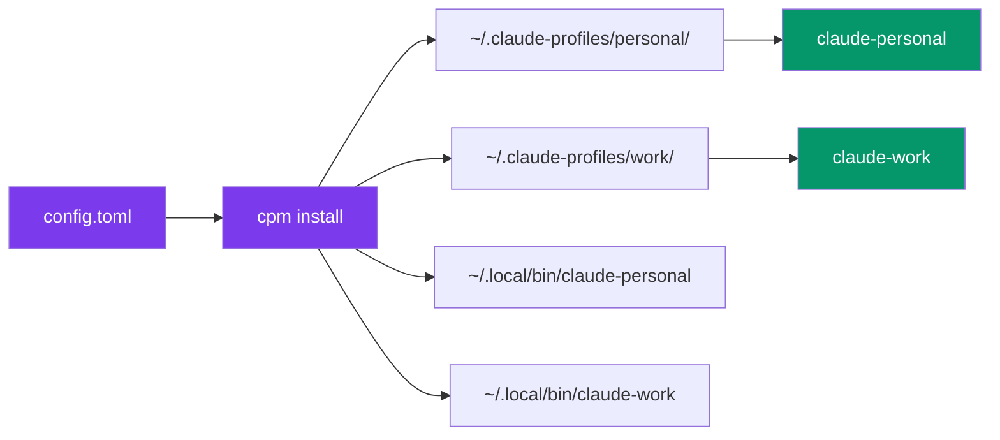
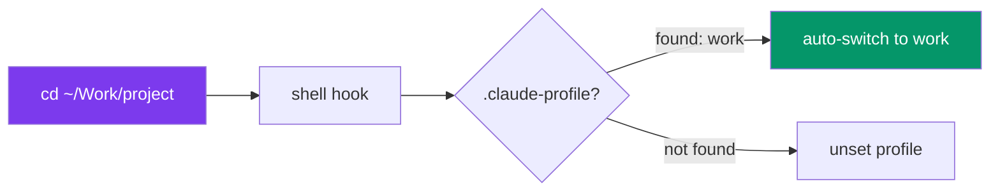

<p align="center">
  
</p>

<h1 align="center">cpm</h1>

<p align="center">
  <strong>Claude Profile Manager</strong> — run multiple Claude Code accounts side-by-side<br/>
  with isolated credentials, shared config, and zero overhead.
</p>

<p align="center">
  <a href="https://github.com/jakubkontra/claude-profile-manager/actions/workflows/test.yml"></a>
  <a href="https://github.com/jakubkontra/claude-profile-manager/releases/latest"></a>
  <a href="https://github.com/jakubkontra/claude-profile-manager/blob/main/LICENSE"></a>
</p>

<p align="center">
  
</p>

---

## Why?

You have a personal Claude subscription and a company one. Or a Vertex AI setup. Or three clients. Every time you switch, you re-login, lose context, or mix credentials.

**cpm** gives each account its own `claude-<name>` command. Run them in parallel, auto-switch per project, never re-login.

```
claude-personal     # Personal Anthropic subscription
claude-work         # Company team account
claude-vertex       # Company via Google Cloud Vertex AI
```

## How it works



Each profile gets an isolated `CLAUDE_CONFIG_DIR` with its own credentials, while sharing commands, skills, plugins, and projects via symlinks:

```
~/.claude-profiles/
├── config.toml
├── personal/
│   ├── settings.json        # Copied (mutable)
│   ├── CLAUDE.md            # Copied (mutable)
│   ├── commands/ -> ~/.claude/commands/   # Symlinked
│   ├── skills/   -> ~/.claude/skills/     # Symlinked
│   ├── plugins/  -> ~/.claude/plugins/    # Symlinked
│   ├── projects/ -> ~/.claude/projects/   # Symlinked
│   ├── .credentials.json    # Per-profile (Linux/CI — on macOS the token lives in the Keychain)
│   ├── .claude.json         # Per-profile (seeded by cpm, maintained by Claude)
│   └── .cpm/baseline/       # What cpm copied, to tell local edits from upstream changes
└── work/
    └── ...
```

Which directories are shared is configurable (`share` / `isolate`, see below). Everything else Claude writes into the profile — `plans/`, `history.jsonl`, `file-history/`, `shell-snapshots/`, `tasks/`, `teams/`, `sessions/` — stays per profile.

## Credentials

Where the OAuth token ends up depends on the platform:

- **macOS** — in the Keychain, under a service derived from the profile's `CLAUDE_CONFIG_DIR`:
  `Claude Code-credentials-<first 8 hex of sha256(configDir)>`. The default `~/.claude` login uses the bare `Claude Code-credentials`, so profiles never overwrite each other or your default session. No `.credentials.json` is written.
- **Linux / CI** — in `<profile>/.credentials.json`.

`cpm doctor` and `cpm credentials` check both, and report which one a profile is using. On Linux the file also tells expiry and subscription type; on macOS `cpm doctor --verify` reads the Keychain token to report the same (this may trigger an access prompt).

Switching a profile to a different account always goes through its wrapper, so only that profile's entry is touched:

```bash
claude-work auth status    # which account this profile is on
claude-work auth logout    # clears only the work entry
claude-work auth login     # OAuth in the browser
```

A bare `claude auth logout` has no `CLAUDE_CONFIG_DIR` set and logs out your default profile instead.

## Install

### Homebrew (macOS/Linux)

```bash
brew install jakubkontra/tap/cpm
```

### GitHub Releases

Download the latest binary from [Releases](https://github.com/jakubkontra/claude-profile-manager/releases/latest):

```bash
# macOS (Apple Silicon)
curl -L https://github.com/jakubkontra/claude-profile-manager/releases/latest/download/cpm_darwin_arm64 -o ~/.local/bin/cpm
chmod +x ~/.local/bin/cpm
```

### From source

```bash
go install github.com/jakubkontra/cpm@latest
```

## Quick start

```bash
# 1. Create config interactively
cpm init

# 2. Or manually create ~/.claude-profiles/config.toml
cat > ~/.claude-profiles/config.toml << 'EOF'
source_dir = "~/.claude"
bin_dir = "~/.local/bin"

[profiles.personal]
description = "Personal account"

[profiles.work]
description = "Company account"
model = "sonnet"
add_dirs = ["~/Work/company"]
EOF

# 3. Install profiles + wrapper scripts
cpm install

# 4. Authenticate each profile (first time only)
claude-personal    # Opens browser for OAuth
claude-work        # Opens browser for OAuth

# Later: add or remove profiles without touching the TOML by hand
cpm add client -d "Client X" -m opus --add-dir ~/Work/client -e CLAUDE_CODE_USE_VERTEX=1
cpm remove client --purge     # also deletes its directory, credentials and Keychain entry
cpm edit                      # open config.toml in $EDITOR
```

New profiles skip Claude's onboarding wizard and get your MCP servers right away: `cpm install` seeds `.claude.json` from `~/.claude.json` (theme, onboarding flags — never your account or project state).

## Per-project profiles (like .nvmrc)



Link a profile to any project directory:

```bash
# Set profile for this project
cd ~/Work/company-project
cpm link work

# Auto-switch on cd (add to .zshrc once)
eval "$(cpm hook)"

# Now every time you cd into this project:
cd ~/Work/company-project
# [cpm] using profile: work

cd ~/personal-project
# [cpm] using profile: personal
```

The `.claude-profile` file is automatically added to `.gitignore`.

## Commands

| Command | Description |
|---------|-------------|
| `cpm install` | Create profile directories and wrapper scripts |
| `cpm install --sync` | Re-sync mutable files from `~/.claude` (refuses to overwrite local edits) |
| `cpm install --sync --force` | Force overwrite diverged files |
| `cpm add <name> [-d desc] [-m model] [--add-dir dir] [-e K=V] [--no-install]` | Add a profile to `config.toml` and install it |
| `cpm remove <name> [--purge] [--yes]` | Remove a profile; `--purge` deletes its directory, credentials and Keychain entry |
| `cpm edit` | Open `config.toml` in `$VISUAL` / `$EDITOR` |
| `cpm list [--json]` | List all profiles with status |
| `cpm which [--json]` | Show active profile (from env or `.claude-profile`) |
| `cpm status` | Check sync divergence |
| `cpm doctor [--json] [--verify]` | Diagnose issues; exit code 1 on errors |
| `cpm credentials [--json]` | Show account, expiry and subscription for all profiles |
| `cpm use <profile\|auto> [--shell fish] [--quiet]` | Switch shell: `eval "$(cpm use work)"`; no argument shows a picker |
| `cpm run <profile> [args]` | One-shot: `cpm run work -p "explain this"` |
| `cpm exec <profile> -- <cmd>` | Run any command with the profile's environment |
| `cpm link <profile>` | Create `.claude-profile` in current dir |
| `cpm unlink` | Remove `.claude-profile` |
| `cpm hook [--shell fish] [--default <profile>]` | Print shell hook for auto-switch |
| `cpm direnv <profile>` | Print `.envrc` snippet |
| `cpm clone <src> <dst>` | Clone profile (without credentials) and register it in config |
| `cpm init` | Interactive config wizard |
| `cpm completion <shell>` | Shell completions (bash, zsh, fish, powershell) |
| `cpm version` | Show version + check for updates |
| `cpm upgrade` | Self-update from GitHub Releases (checksum-verified; Homebrew installs use `brew upgrade`) |
| `cpm cloud init [--remote <url>]` | Initialize cloud sync repo |
| `cpm cloud push [-m "msg"] [--dry-run] [--allow-secrets]` | Push local settings to cloud |
| `cpm cloud pull [--dry-run]` | Pull settings from cloud and re-sync profiles |
| `cpm cloud diff` | Show local changes since the last sync |
| `cpm cloud status` | Show cloud sync status |
| `cpm cloud remote <url>` | Set/update git remote URL |

## Cloud sync

Sync your Claude Code settings (plugins, skills, commands, `settings.json`) across machines via a private git repository.

```bash
# On your first machine — initialize and push
cpm cloud init --remote git@github.com:you/claude-settings.git
cpm cloud push

# On another machine — clone and pull
cpm cloud init --remote git@github.com:you/claude-settings.git
# Files are automatically distributed on clone

# Later — sync changes
cpm cloud push   # from the machine where you changed settings
cpm cloud pull   # on the other machine
```

### What gets synced

| Synced | Not synced |
|--------|------------|
| `settings.json` | Credentials (`.credentials.json`, Keychain) |
| `CLAUDE.md` | `settings.local.json` (machine-specific; opt in with `include`) |
| `commands/`, `agents/`, `skills/` | Sessions, caches, `projects/` |
| `plugins/installed_plugins.json` | Telemetry |
| `plugins/known_marketplaces.json` | |
| `~/.agents/.skill-lock.json` (as `skills/skill-lock.json`) | |
| CPM `config.toml` (profiles are merged, never overwritten) | |

Before pushing, cpm scans the `env` block of every synced `settings*.json` for values that look like API keys or tokens and refuses to push them. Keep secrets in the profile's `env` in `config.toml` (which is synced as plain text too — use a private repo) or pass `--allow-secrets`.

### Tune what gets synced

```toml
[cloud]
remote = "git@github.com:you/claude-settings.git"
exclude = ["CLAUDE.md", "commands/"]     # drop from the sync set
include = ["settings.local.json"]        # add files relative to ~/.claude
auto_push = true                         # push after every `cpm install`
auto_pull_on_install = true              # pull before every `cpm install`
```

## Configuration

### `~/.claude-profiles/config.toml`

```toml
source_dir = "~/.claude"
bin_dir = "~/.local/bin"

[profiles.personal]
description = "Personal Anthropic account"

[profiles.work]
description = "Company team subscription"
model = "sonnet"
add_dirs = ["~/Work/company"]
isolate = ["projects"]             # keep work session history separate from personal
mcp_exclude = ["personal-notion"]  # global MCP server this profile must not see

[profiles.work.attribution]
commit = "Co-Authored-By: Claude <noreply@anthropic.com>"
pr = "Generated with [Claude Code](https://claude.ai/code)"

[profiles.work.settings]           # deep-merged into the profile's settings.json
effortLevel = "high"
permissions.allow = ["Bash(gh *)"]

[profiles.work.mcp_servers.jira]   # profile-specific MCP server
command = "npx"
args = ["-y", "@example/jira-mcp"]

[profiles.vertex]
description = "Company via Vertex AI"
add_dirs = ["~/Work/company"]

[profiles.vertex.env]
CLAUDE_CODE_USE_VERTEX = "1"
ANTHROPIC_VERTEX_PROJECT_ID = "your-project-id"
CLOUD_ML_REGION = "europe-west1"
```

### Config reference

| Field | Default | Description |
|-------|---------|-------------|
| `source_dir` | `~/.claude` | Source for shared config |
| `bin_dir` | `~/.local/bin` | Where wrapper scripts are installed |
| `profiles.<name>.description` | | Human-readable description |
| `profiles.<name>.model` | | Default model (`sonnet`, `opus`) |
| `profiles.<name>.add_dirs` | | Extra dirs passed via `--add-dir` |
| `profiles.<name>.env` | | Environment variables |
| `profiles.<name>.attribution.commit` | | Git commit attribution text |
| `profiles.<name>.attribution.pr` | | PR description attribution text |
| `profiles.<name>.settings` | | Table deep-merged into the profile's `settings.json` (maps merge, other values replace) |
| `profiles.<name>.share` | inherits | Directories symlinked from `source_dir` (replaces the global list) |
| `profiles.<name>.isolate` | `[]` | Directories removed from the share list for this profile |
| `profiles.<name>.mcp_exclude` | `[]` | Global MCP servers this profile does not get |
| `profiles.<name>.mcp_servers.<id>` | | Profile-specific MCP server (same keys as in `~/.claude.json`) |
| `share` | `["commands", "skills", "agents", "plugins", "projects"]` | Default shared directories |
| `cloud.remote` | | Git remote URL for cloud sync |
| `cloud.auto_push` | `false` | Push after `cpm install` |
| `cloud.auto_pull_on_install` | `false` | Pull before `cpm install` |
| `cloud.exclude` | `[]` | Files/dirs to exclude from sync |
| `cloud.include` | `[]` | Extra files (relative to `source_dir`) to sync |
| `cloud.allow_secrets` | `false` | Skip the API-key check before pushing |

Profile names may contain letters, digits, `-` and `_` only.

### Shared file handling

| Type | Files | Behavior |
|------|-------|----------|
| **Copied** | `settings.json`, `settings.local.json`, `CLAUDE.md` | Copied on first install. `--sync` refreshes files you have not edited locally; `--force` overwrites the rest. |
| **Symlinked** | `commands/`, `skills/`, `agents/`, `plugins/`, `projects/` (configurable via `share` / `isolate`) | Shared across profiles |
| **Per-profile** | `.credentials.json`, `.claude.json`, `plans/`, `history.jsonl`, `teams/`, ... | Created by Claude on first use |

## Shell integration

### Prompt (PS1 / Starship)

Show active profile in your terminal prompt:

```bash
# .zshrc — simple
PROMPT='$(cpm prompt)> '

# Starship — custom command
[custom.claude]
command = "cpm prompt"
when = "test -n \"$CLAUDE_PROFILE\""
format = "[$output]($style) "
style = "purple"
```

### Auto-switch hook

```bash
# .zshrc / .bashrc
eval "$(cpm hook)"
eval "$(cpm hook --default personal)"   # use "personal" outside linked projects

# fish (~/.config/fish/config.fish)
cpm hook --shell fish | source
```

The hook only unsets the variables it set itself (tracked in `CPM_MANAGED_VARS`), so your own `CLAUDE_*` / `ANTHROPIC_*` variables survive a `cd`. In bash it runs from `PROMPT_COMMAND`, so `pushd`/`popd` and scripts are covered too.

### Manual switching

```bash
eval "$(cpm use work)"            # bash / zsh
eval "$(cpm use auto)"            # from the nearest .claude-profile
eval "$(cpm use)"                 # interactive picker
cpm use --shell fish work | source
```

### Completions

```bash
cpm completion zsh > "${fpath[1]}/_cpm"      # zsh
cpm completion bash > /etc/bash_completion.d/cpm
cpm completion fish > ~/.config/fish/completions/cpm.fish
```

### direnv

```bash
# Generate .envrc for a project
cpm direnv work >> ~/Work/company-project/.envrc
direnv allow ~/Work/company-project
```

### Scripts and CI

```bash
cpm exec work -- git commit -m "..."     # any command with the profile's env
cpm list --json | jq -r '.[] | select(.current) .name'
cpm doctor --json && echo healthy       # exit code 1 on errors
```

## Upgrading

```bash
# Self-update
cpm upgrade

# Or via Homebrew
brew upgrade cpm
```

## Requirements

- macOS or Linux
- Claude Code installed and on PATH
- `~/.local/bin` on PATH (or configure `bin_dir`)

## License

[MIT](LICENSE)
